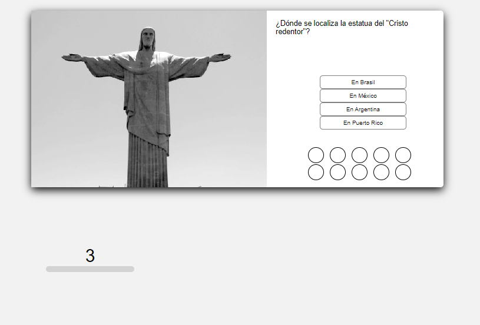

# Which country is it?

This is an exercise of JavaScript in which you have to choose, among 4 options, the right one about where the place in the picture is.

## Table of contents

- [Overview](#overview)
  - [The challenge](#the-challenge)
  - [Screenshot](#screenshot)
  - [Links](#links)
- [My process](#my-process)
  - [Built with](#built-with)
  - [What I learned](#what-i-learned)
  - [Useful resources](#useful-resources)
- [Author](#author)

## Overview

### The challenge

Users should be able to:

- Select in 10 seconds the right answer to the question on screen, based on the picture
- Get their final results, with wrong and correct answers

### Screenshot

  
💻 Desktop

  

### Links

- Live Site URL: [Which country is it?](https://themattfire.github.io/which-country-is-it/)

## My process

### Built with

- JavaScript

An initial diagram was made to understand the process

  <summary💡 Diagram

  

### What I learned

I put on practice my knowledge on javascript, specially about validations, building innerhtml and adding classes to elements

### Useful resources

- [Create a Multiple Choice Quiz App Using JavaScript](https://www.youtube.com/watch?v=49pYIMygIcU) - Used this code as reference

## Author

- Github - [@themattfire](github.com/themattfire)
